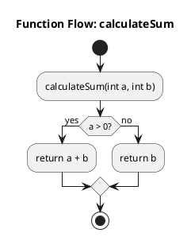

# Quick Reference Guide - Function Flow Diagrams

## 🎯 What's New?

Agent1 now generates **real function flow diagrams** with control flow (if/else, loops, switches) - not just empty styling!

---

## 🚀 Quick Start

### 1. Analyze Your Project
```bash
cd "C:\Users\Vishal shakya\cursor-workspace\Agent1"

# Analyze the PoseidonOS trace module
python main.py analyze "path/to/poseidonos/src/trace"
```

### 2. List Functions
```bash
# Show functions with most control flow first
python main.py list-functions --limit 30
```

### 3. Generate Flow Diagrams
```bash
# Generate for a specific function
python main.py flowchart --type function_flow --entry-point functionName

# Generate for all interesting functions (auto-detects)
python main.py flowchart --type function_flow
```

### 4. View the Diagrams
- Open `outputs/flow_functionName.puml`
- View online: http://www.plantuml.com/plantuml/uml/
- Or use VSCode PlantUML extension

---

## 📋 Command Reference

| Command | Description |
|---------|-------------|
| `python main.py analyze <path>` | Parse C++ project |
| `python main.py list-functions` | List all functions |
| `python main.py flowchart --type function_flow` | Generate flow diagrams |
| `python main.py flowchart --type function_call` | Generate call graph |
| `python main.py flowchart --type class` | Generate class diagram |
| `python main.py flowchart --type module` | Generate module structure |
| `python main.py interactive` | Interactive mode |

---

## 🎨 What Gets Generated?

### ✅ NOW (After Fix)



**Result**: A complete flowchart with decision diamonds, boxes, and arrows!

### ❌ BEFORE (Old Behavior)

```plantuml
@startuml
skinparam sequence {
  ArrowColor DeepSkyBlue
}
@enduml
```

**Result**: Just styling, no content!

---

## 🔍 Control Flow Detection

Agent1 automatically detects and visualizes:

| C++ Structure | PlantUML Output |
|---------------|-----------------|
| `if (condition) { } else { }` | Decision diamond with yes/no branches |
| `for (int i = 0; i < n; i++)` | Repeat loop structure |
| `while (condition)` | While loop with true/false |
| `switch (value) { case x: }` | Switch with multiple cases |
| `function_call()` | Activity box |
| `return value;` | Return statement |

---

## 📁 Output Files

All diagrams saved to `outputs/` directory:

| File Pattern | Description |
|-------------|-------------|
| `flow_functionName.puml` | Detailed flow for specific function |
| `test_overview.puml` | Function call overview |
| `class_diagram.puml` | Class relationships |
| `module_structure.puml` | File organization |

---

## 🖼️ Viewing Options

### Option 1: Online (Easiest) ⭐
1. Visit http://www.plantuml.com/plantuml/uml/
2. Copy `.puml` file content
3. Paste and view instantly

### Option 2: VSCode Extension
1. Install "PlantUML" extension
2. Open `.puml` file
3. Press `Alt+D`

### Option 3: Command Line
```bash
# Install
pip install plantuml

# Generate PNG
plantuml outputs/flow_functionName.puml
```

---

## 💡 Pro Tips

### Tip 1: Find Complex Functions
```bash
python main.py list-functions --limit 50
```
Functions are sorted by control flow complexity - the most interesting ones appear first!

### Tip 2: Interactive Mode
```bash
python main.py interactive

> list                    # List functions
> flow functionName       # Generate flow
> stats                   # Show statistics
```

### Tip 3: Generate Multiple Diagrams
```bash
# Analyze project
python main.py analyze "path/to/code"

# Generate all diagram types
python main.py flowchart --type function_flow
python main.py flowchart --type function_call
python main.py flowchart --type class
python main.py flowchart --type module
```

### Tip 4: Check Control Flow Info
After analyzing, check the function list:
```
Functions with control flow:
  - main: 5 flow nodes
  - processData: 3 flow nodes
  - calculateSum: 2 flow nodes
```

Functions with more flow nodes = more interesting diagrams!

---

## 🎯 For PoseidonOS Trace Module

### Step-by-Step

```bash
# 1. Clone the repo (if not already done)
git clone https://github.com/poseidonos/poseidonos.git

# 2. Analyze the trace module
cd "C:\Users\Vishal shakya\cursor-workspace\Agent1"
python main.py analyze "poseidonos/src/trace"

# 3. List functions (to find interesting ones)
python main.py list-functions --limit 30

# 4. Generate flows for top functions
python main.py flowchart --type function_flow

# 5. Check outputs
dir outputs\flow_*.puml
```

### Expected Output

You'll see diagrams for functions like:
- Trace initialization routines
- Event handling logic
- Buffer management
- Memory allocation
- Error handling paths

Each showing:
- ✅ If/else decisions
- ✅ Loop structures
- ✅ Function calls
- ✅ Return paths
- ✅ Error handling

---

## 🐛 Troubleshooting

### "No functions with control flow found"
**Solution**: The functions are too simple. Try a different module with more complex logic.

### "Module not found: tree_sitter_cpp"
**Solution**: Install dependencies:
```bash
pip install -r requirements.txt
```

### "Empty diagram generated"
**Solution**: Check that the function exists:
```bash
python main.py list-functions
```

### "Can't view .puml files"
**Solution**: Use the online viewer:
1. Open outputs/flow_name.puml in a text editor
2. Copy the content
3. Visit http://www.plantuml.com/plantuml/uml/
4. Paste and view

---

## 📚 Documentation

- **Full Guide**: See `CONTROL_FLOW_UPDATE.md`
- **Examples**: See `EXAMPLES.md`
- **PlantUML Syntax**: See `README_PLANTUML.md`
- **General Usage**: See `README.md`

---

## ✨ Features Summary

| Feature | Status |
|---------|--------|
| If/Else diagrams | ✅ |
| For loops | ✅ |
| While loops | ✅ |
| Switch/case | ✅ |
| Nested structures | ✅ |
| Function calls | ✅ |
| Return statements | ✅ |
| Color coding | ✅ |
| Auto-detection | ✅ |
| Batch generation | ✅ |

---

## 🎨 Visual Style

The diagrams match your reference images with:

- **Green boxes** (#B4E7CE) - Activities/processes
- **Yellow diamonds** (#FFD966) - Decisions/conditions
- **Blue start** (#4A90E2) - Entry point
- **Red stop** (#E74C3C) - Exit point
- **Clear arrows** - Flow direction

---

## 📞 Need Help?

1. Check `EXAMPLES.md` for code samples
2. Read `CONTROL_FLOW_UPDATE.md` for technical details
3. Try the test script: `python test_simple_flow.py`
4. Use interactive mode for experimentation

---

**Version**: 2.0 (with Control Flow)  
**Date**: December 13, 2025  
**Status**: ✅ Production Ready

---

## 🔄 Migration from Old Version

If you used the old Agent1:

### Old Way ❌
```bash
python main.py flowchart --type function_call
# Result: Only styling, no real flow
```

### New Way ✅
```bash
python main.py flowchart --type function_flow
# Result: Complete flow diagram with control structures!
```

**All your old commands still work**, but now you have the new `function_flow` type for detailed control flow diagrams!

---

## 🎁 Bonus Features

### List Functions Sorted by Complexity
```bash
python main.py list-functions --limit 30
```
Output shows:
- Function name
- Return type
- Number of control flow nodes
- Number of function calls
- Source file

### Interactive Exploration
```bash
python main.py interactive

> list                        # See all functions
> flow main                   # Generate flow for main()
> flow                        # Auto-generate interesting ones
> stats                       # Project statistics
> query "how does X work?"    # AI-powered Q&A
```

---

**Happy Diagramming! 🎉**
