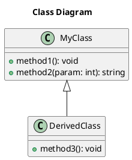
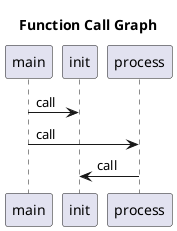

# PlantUML Diagrams Guide

The agent now generates **PlantUML diagrams** instead of images. This is better for SSH/terminal environments because:

✅ **Text-based** - Easy to view in terminal  
✅ **Lightweight** - No binary image files  
✅ **Editable** - Can modify diagrams easily  
✅ **Version control friendly** - Text diffs work  
✅ **Portable** - View anywhere (online, VSCode, local tools)  

## Quick Start

```bash
# 1. Analyze and generate diagrams
python3 main.py analyze /path/to/cpp/project --flowchart all

# 2. View diagrams
python3 view_plantuml.py

# This creates diagrams_report.html - download and open in browser!
```

## Generated Files

Diagrams are saved in `./diagrams/` as `.puml` files:
- `function_call_graph.puml` - Function call relationships
- `class_diagram.puml` - Classes and inheritance
- `module_structure.puml` - File/directory organization

## Viewing Options

### Option 1: HTML Report (Easiest)

```bash
python3 view_plantuml.py
# Download diagrams_report.html via MobaXterm file browser
# Open in browser and click "View Online" buttons
```

### Option 2: Online Viewers

**PlantText (Recommended):**
1. Copy .puml file content
2. Go to: https://planttext.com/
3. Paste and see diagram instantly!

**PlantUML Server:**
- http://www.plantuml.com/plantuml/uml/

### Option 3: VSCode Extension

1. Install "PlantUML" extension in VSCode
2. Download .puml files
3. Open in VSCode
4. Press `Alt+D` to preview

### Option 4: View as Text

```bash
# Just read the .puml file - it's human-readable!
cat diagrams/class_diagram.puml
```

### Option 5: Generate Images Locally

If you have PlantUML installed:

```bash
# Install PlantUML (one-time)
sudo apt install plantuml

# Generate PNG images
plantuml diagrams/*.puml

# Generate SVG images
plantuml -tsvg diagrams/*.puml
```

## PlantUML File Structure

### Class Diagram Example


### Function Call Graph Example


## Benefits Over Image-Based Diagrams

| Feature | Images (PNG) | PlantUML Text |
|---------|-------------|---------------|
| File size | Large | Small |
| View over SSH | Difficult | Easy |
| Edit | Need tools | Any text editor |
| Version control | Binary diffs | Text diffs |
| Search | No | Yes |
| Copy/paste | No | Yes |

## Workflow for MobaXterm Users

```bash
# 1. On server: Generate diagrams
cd Agent1
python3 main.py analyze /path/to/cpp/project --flowchart all

# 2. Generate HTML report
python3 view_plantuml.py

# 3. In MobaXterm:
#    - Use left sidebar file browser
#    - Navigate to Agent1/
#    - Double-click diagrams_report.html
#    - Browser opens with all diagrams!
```

## Advanced Usage

### Custom Diagram Names

```bash
python3 main.py analyze /path/to/project --flowchart function_call
# Then rename or customize the .puml files as needed
```

### Modify Diagrams

PlantUML files are text - just edit them:

```bash
nano diagrams/class_diagram.puml
# Add colors, notes, or modify structure
```

### Batch Convert to Images

```bash
# Generate all diagrams as PNG
for f in diagrams/*.puml; do
    plantuml "$f"
done

# Now you have both .puml (editable) and .png (viewable) files
```

## PlantUML Syntax Resources

- **Official Site:** https://plantuml.com/
- **Class Diagrams:** https://plantuml.com/class-diagram
- **Sequence Diagrams:** https://plantuml.com/sequence-diagram
- **Component Diagrams:** https://plantuml.com/component-diagram

## Troubleshooting

### "diagrams/ directory not found"
```bash
# Run analyze first to generate diagrams
python3 main.py analyze /path/to/project --flowchart all
```

### "Cannot view online"
- Copy the .puml file content
- Paste at https://planttext.com/
- Diagram renders instantly

### "Want to generate images"
```bash
# Install PlantUML
sudo apt install plantuml default-jre

# Generate images
cd diagrams
plantuml *.puml
```

## Examples

See the generated `.puml` files in `diagrams/` directory for examples of:
- Function call graphs with sequence diagrams
- Class diagrams with inheritance
- Module structure with component diagrams

---

**Happy diagramming!** 🎨📊

For more help, see: https://plantuml.com/guide


